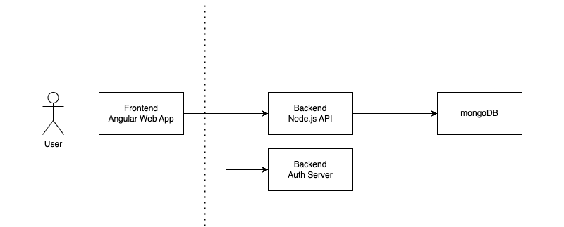
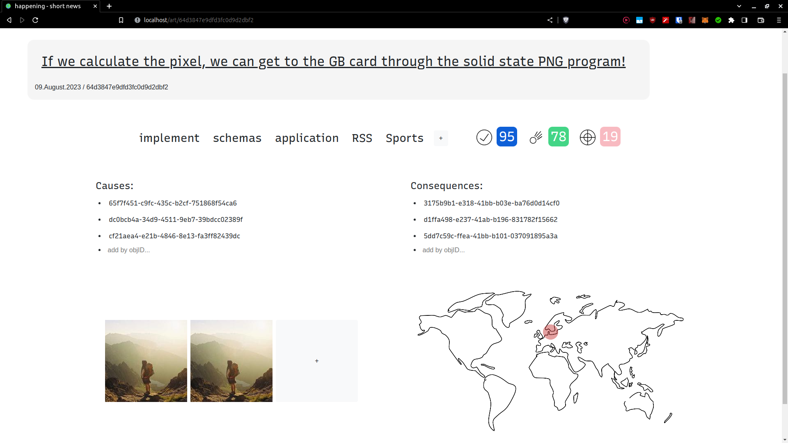
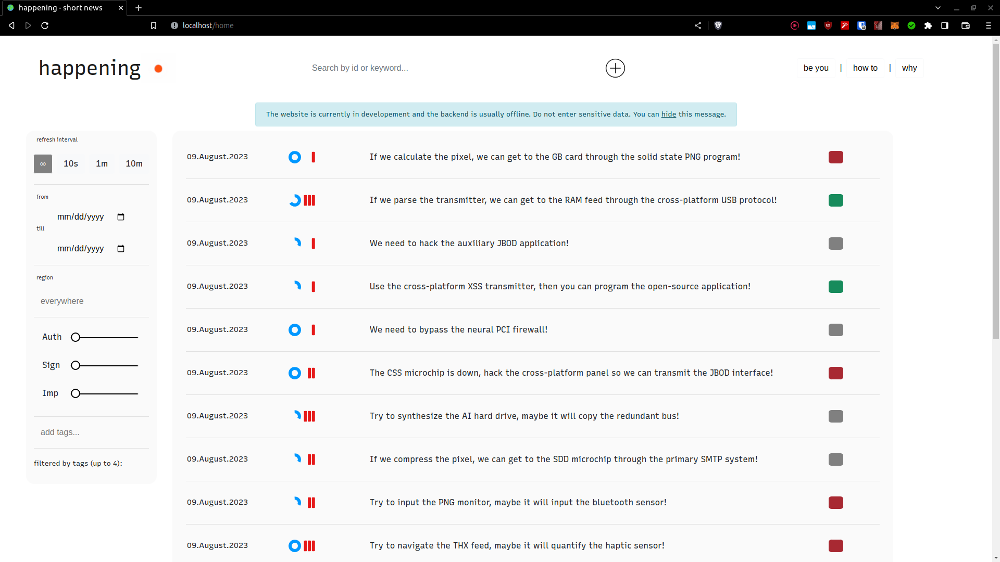
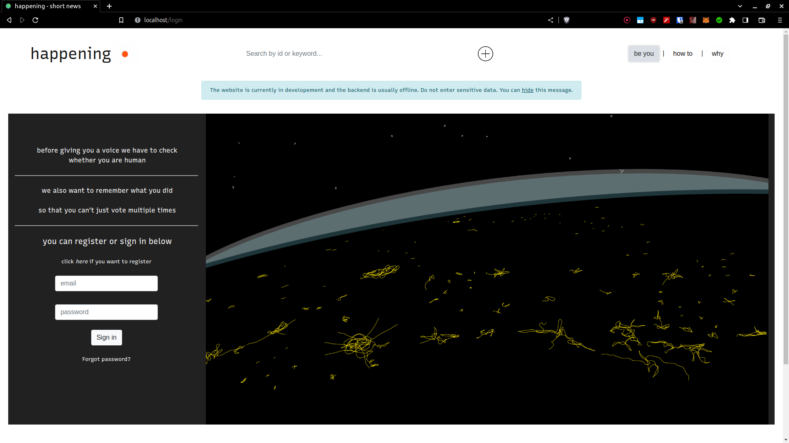
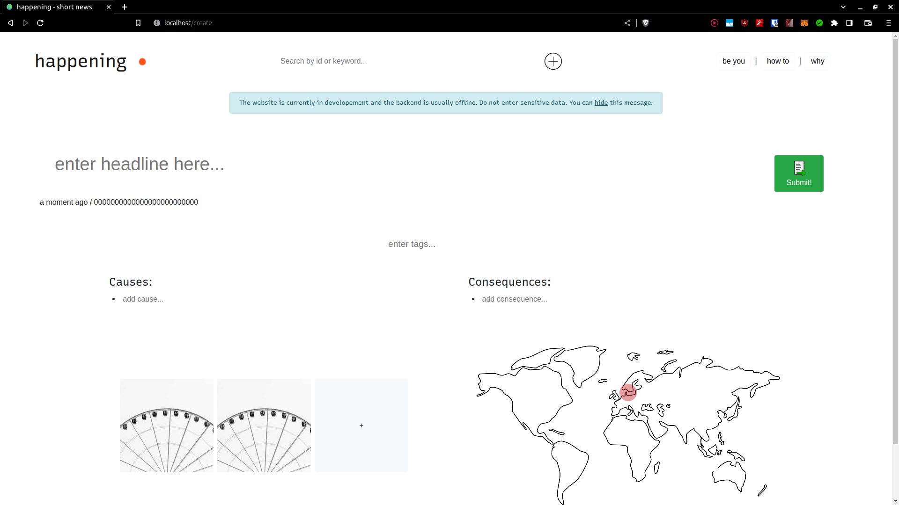
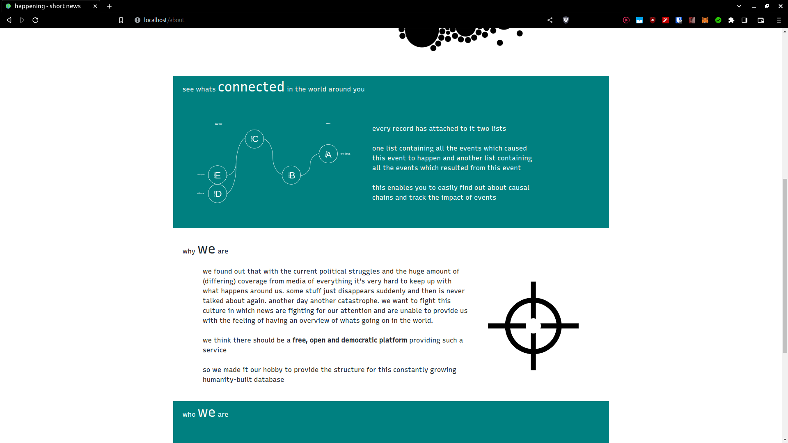
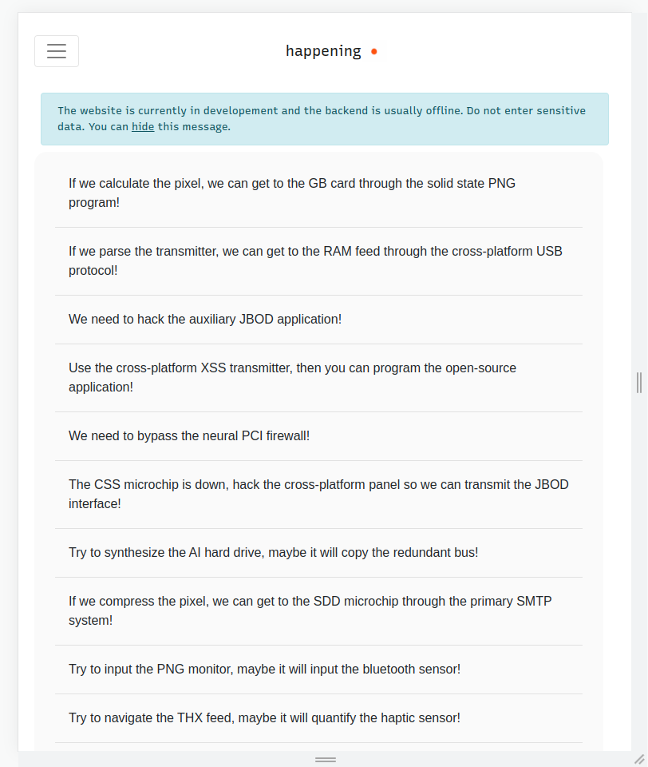
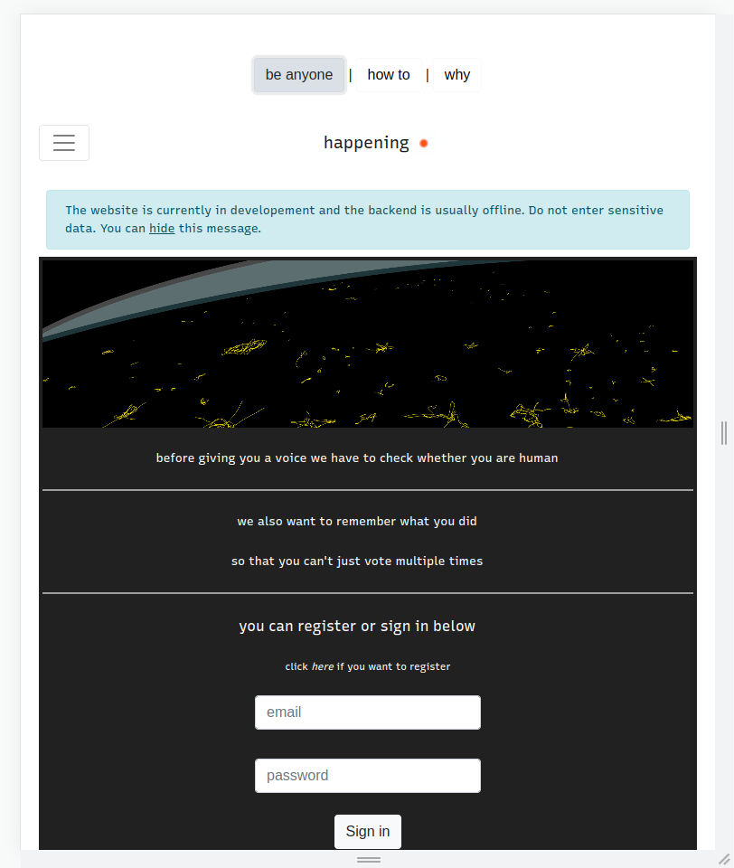

#  happening.link

This was a project I worked on for a few weeks in my 2nd semester (Fall 2020) studying computer science, trying to learn more about web development. At the time I was frustrated with how biased news are usually presented to us and in 2020 fake news was also a rather big issue. So I thought it would be a cool idea to have a platform where every human could participate and share their perspective on what was going on, objectively describing what had occurred. I wanted to capture and digitize what was _happening_ in our world, and what the causes and consequences of each event were, without any bias or opinions involved. Needless to say, that this idea has some issue, e.g. policy, scalability and verification, but I liked it and started working on it. I abandoned it at the end of the semester break, when university started again.

Fast forward to Summer 2023, and I just spent a few hours trying to get this working again, dockerize it and put some things in order. 
Below you will find a list of features I developed, and a diagram with the architecture I was having in mind.

  

### Features
- search
  - headline text search, or by article id
- filters (tags, regions, keywords, dates, metrics)
- dashboard (lists all articles)
  - sorted by most recent
  - updates automatically (disabled)
- article view
  - click on tags to view all articles with same tags
  - causes and consequences uids are clickable and link to the corresponding article
  - (demo uses randomly generated uids, so they dont resolve to actual headlines)
- propose new articles (+reactive add button)
- propose changes in articles
- login/registration (disabled)
  - led to different view where one could vote on proposed changes
  - required separate auth server
- informational pages (about, how to, privacy, cookies, impressum)
- mobile view (no suggestions possible)
- custom assets created by myself
- input validation in most places
- cookie banner
- animated page transitions (slide)

### Desktop View

  
  
  

  
   

### Mobile View

  
   

### Run
To test using / host the website and database locally, follow the directions below:
- simply copy/download the `docker-compose.yml` and run `sudo docker-compose up`
- the website will be accessible on `http://localhost:80`
- initially the mongodb will be empty, and regular users (without login) cannot post new articles
- therefore better import the provided `happening.postman_collection.json` collection into postman to add some articles to look at
  - simply press import, then select file, then run the randomArticle request a few times

### Development
To work with the app, follow the directions below:
- clone this
- install nvm `wget -qO- https://raw.githubusercontent.com/nvm-sh/nvm/v0.39.4/install.sh | bash`
- install node version 10 `nvm install 10`
- use node version 10 `nvm use 10`
- install angular v10 `npm install -g @angular/cli@10.1.5`
- run `npm install `
- run `ng serve`, the website will be accessible on `localhost:4200` and have live changes
- maybe also spin up the database separately, if you work with articles

### Build
to build the docker image, follow the directions below:
- check if `ng build` completes without any fatal errors
- run `sudo docker build -t rbin1/happening:VERSION .`
- run `sudo docker push rbin1/happening:VERSION`
  - this might require `docker login` to be run first
